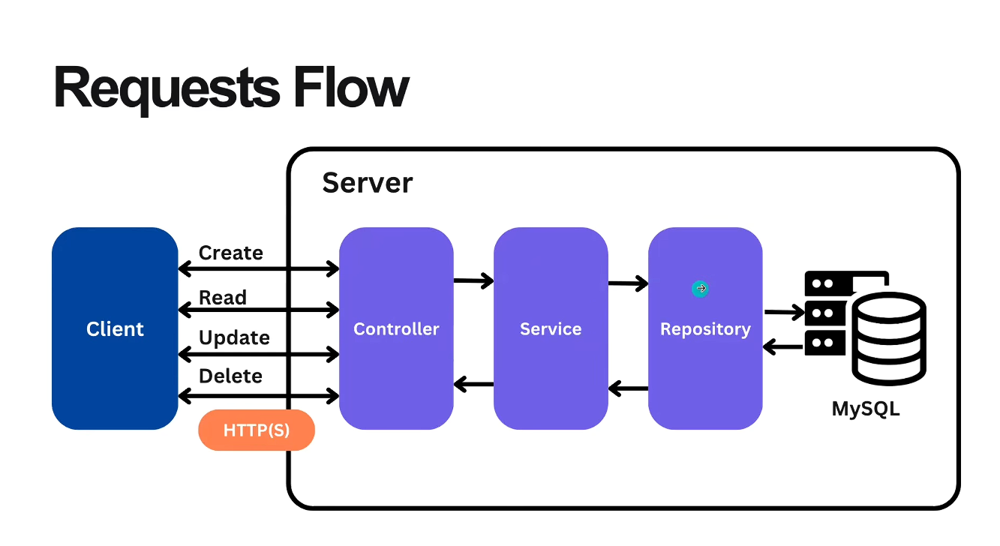
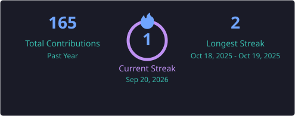
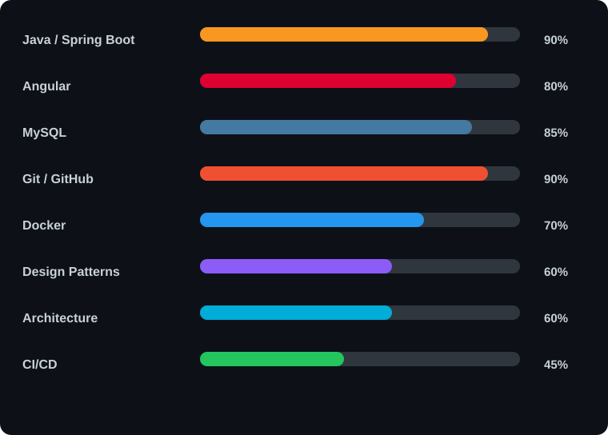

<div align="center">

[](https://git.io/typing-svg)

</div>

### 💻 Software Developer | Java & Spring Boot | React | Angular | Flask

Passionné par le développement logiciel et la conception d’applications modernes, je construis des solutions **robustes, maintenables et orientées utilisateurs**.

Je travaille principalement avec **Java, Spring Boot, React, Angular, Flask , MySQL et postgres**. 
Je m’intéresse particulièrement à l’architecture logicielle, aux API REST, au développement Full-Stack, à l’expérience utilisateur et aux bonnes pratiques de développement.

---
## 🚀 À propos de moi

- 🎓 Licence en **Développement d’Applications**.
- 💻 Développeur **Java / Spring Boot, React, Angular et Flask**.
- 🔧 Expérience dans la conception et la consommation d’**API REST**.
- 🗄️ Travail avec **MySQL** et les bases de données relationnelles.
- 🐳 Utilisation de **Docker** pour la conteneurisation.
- 🎨 Création et intégration de maquettes réalisées avec **Figma**.
- ⚡ Utilisation de **Vite** pour le développement d’applications React.
- 🔀 Gestion de versions avec **Git et GitHub**.
- 🧩 Intérêt pour l’architecture logicielle et les Design Patterns.
- 🚀 Progression continue vers un profil de **Full-Stack Developer**.

> 🎯 Mon objectif : concevoir des applications utiles, évolutives et adaptées aux besoins réels des utilisateurs.

---

## 🛠️ Technologies et outils

### Backend

<div align="left">


</div>

### Frontend

<div align="left">


</div>

### Base de données

<div align="left">


</div>

### Design et outils

<div align="left">


</div>

---

## 🧑‍💻 Architecture et concepts

Je m’intéresse notamment à :

- ✅ Architecture MVC.
- ✅ Architecture en couches.
- ✅ Développement d’API REST.
- ✅ Séparation des responsabilités.
- ✅ Pattern Repository / Service / Controller.
- ✅ Validation des données.
- ✅ Gestion globale des exceptions.
- ✅ Authentification et autorisation.
- ✅ Clean Code.
- ✅ Design Patterns.
- ✅ Git Flow.
- ✅ Conteneurisation avec Docker.
- ✅ Intégration continue avec GitHub Actions.
- ✅ Conception d’interfaces à partir de maquettes Figma.

---

## 🏗️ Flux d’une requête Spring Boot

<p align="center">
  
</p>

<p align="center">
  <i>
    Flux d’une requête HTTP à travers les différentes couches de l’application :
    Controller → Service → Repository → MySQL
  </i>
</p>

---

## 🚀 Projets

### 🏥 Application de gestion hospitalière

Application Full-Stack destinée à faciliter la gestion des patients, médecins, rendez-vous et informations hospitalières.

**Technologies :**

`Java` `Spring Boot` `Angular` `MySQL` `Docker`

---

### 🏫 Application de gestion scolaire

Application permettant de gérer les étudiants, enseignants, classes, matières et différentes opérations administratives.

**Technologies :**

`Java` `Spring Boot` `Angular` `MySQL`

---

### 🏠 Gestion immobilière en ligne

Application permettant de gérer et consulter des biens immobiliers à travers une plateforme web.

**Technologies :**

`Spring Boot` `Angular` `MySQL` `REST API`

---

### ⚛️ Application Full-Stack React et Flask

Projet Full-Stack réalisé avec **React** pour l’interface utilisateur et **Flask** pour le backend.

**Technologies :**

```text
React · JavaScript · Flask · Python · REST API
```

**Architecture du projet :**

```

React
  ↓
API REST Flask
  ↓
Base de données

```

**Compétences mises en pratique :**

- Création d’interfaces dynamiques avec React.
- Développement d’API REST avec Flask.
- Échange de données entre frontend et backend.
- Gestion des composants React.
- Gestion des routes et des requêtes HTTP.
- Organisation d’un projet Full-Stack.
- Connexion à une base de données.
- Séparation entre la logique métier et l’interface utilisateur.

> 🔗 Le lien vers ce projet sera ajouté prochainement.

---

### 🛒 Application de gestion commerciale — En cours

Application de gestion commerciale destinée à faciliter le suivi des produits, des clients, des ventes et des opérations commerciales.

Le frontend est développé avec **React et Vite**, tandis que le backend repose sur **Spring Boot**. Les interfaces sont conçues à partir de maquettes réalisées avec **Figma**.

**Technologies :**

```

React · Vite · Java · Spring Boot · MySQL · Figma · REST API
```

**Architecture prévue :**

```

Maquettes Figma
      ↓
React + Vite
      ↓
API REST Spring Boot
      ↓
    MySQL

```

**Fonctionnalités prévues :**

- Gestion des produits.
- Gestion des catégories.
- Gestion des clients.
- Gestion des fournisseurs.
- Gestion des ventes.
- Suivi des stocks.
- Gestion des utilisateurs.
- Tableau de bord commercial.
- Authentification et autorisation.
- Communication entre React et Spring Boot.
- Validation des données.
- Gestion centralisée des erreurs.

 ```

## 📊 Statistiques GitHub

<div align="center">





</div>

---

## 🔥 GitHub Streak

<div align="center">



</div>

---

## 🏆 GitHub Trophies

<div align="center">



</div>

---

## 📈 Activité GitHub

<div align="center">


</div>

---

## 📚 Progression technique


<div align="center">



</div>


> Indicateurs de progression personnels, mis à jour via GitHub Actions.

---

## 🎯 Mes objectifs

* 🚀 Approfondir **Spring Boot**
* ⚡ Maîtriser **Angular**
* 🧠 Renforcer mes connaissances en **Architecture Logicielle**
* 🧩 Maîtriser davantage les **Design Patterns**
* 🔄 Mettre en place des pipelines **CI/CD**
* 🐳 Approfondir **Docker & DevOps**
* 🤖 Explorer le développement assisté par **l'IA**
* 🌍 Construire des solutions adaptées aux problématiques locales

---

## 🤝 Collaborons

Je suis ouvert aux :

* 💡 Projets innovants
* 🤝 Collaborations Open Source
* 🚀 Projets Full-Stack
* 📚 Échanges autour du développement logiciel
* 💼 Opportunités professionnelles

---

## 📫 Me contacter

<div align="center">

<a href="https://github.com/tadzo-morel">

</a>

<a href="https://www.linkedin.com/">

</a>

</div>

---

<div align="center">

### 💡 « Construire. Apprendre. Améliorer. Recommencer. »


</div>
